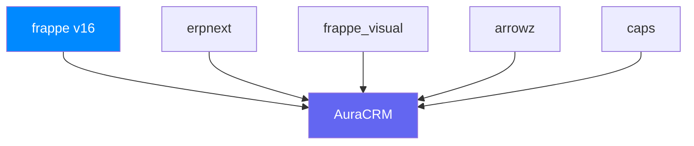

# AuraCRM — Dependency Graph
# أورا سي آر إم — مخطط التبعيات

```mermaid
graph TD
    frappe["frappe v16"]
    erpnext["erpnext"]
    frappe_visual["frappe_visual"]
    arrowz["arrowz"]
    caps["caps"]
    auracrm["AuraCRM"]
    frappe --> auracrm
    erpnext --> auracrm
    frappe_visual --> auracrm
    arrowz --> auracrm
    caps --> auracrm
    style auracrm fill:#6366F1,color:#fff
    style frappe fill:#0089FF,color:#fff
```
