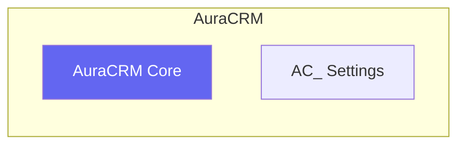

# AuraCRM — Module Map
# أورا سي آر إم — خريطة الوحدات

```mermaid
graph LR
    subgraph AuraCRM
        Core["AuraCRM Core"]
        Settings["AC_ Settings"]
    end
    style Core fill:#6366F1,color:#fff
```

> **Note:** This is a placeholder module map. Update with actual modules from `modules.txt`.
